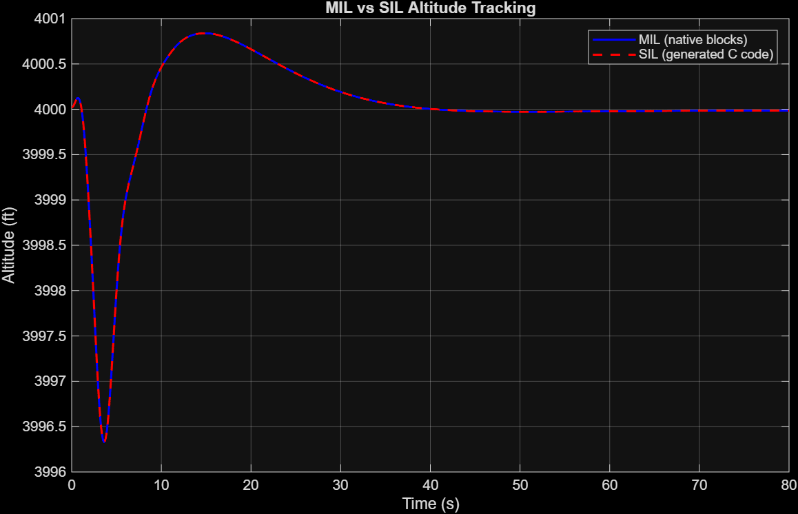

# SIL Test Report

## Test setup
Controller: generated C++ code (`Autopilot.c` / `Autopilot_data.c`), tested via Simulink Model-block SIL simulation
Plant: JSBSim c172p
Test: altitude step from initial condition to 4000 ft target

## MIL vs SIL comparison

- Max error: 0.0000%
- Mean error: 0.0000%
- Result: **PASS** — generated code matches native Simulink simulation essentially exactly, confirming the auto-generated C++ correctly implements the same control logic as the Simulink model it was generated from.

## Requirement verification (from SIL run)

| Requirement | Result | Evidence |
|---|---|---|
| REQ-001 (pitch returns to trim within ±2°, post-settling) | **PASS** | max settled pitch deviation from trim: 0.0013 deg |
| REQ-002 (altitude hold within ±5 m, post-settling) | **PASS** | max settled altitude deviation: 0.0083 m (0.0272 ft) |
| REQ-006 (SIL matches MIL within 5%) | **PASS** | 0.0000% max error, 0.0000% mean error |
| REQ-010 (generated code passes SIL verification against MIL) | **PASS** | same evidence as REQ-006 |

## Notes
- Trim condition for this test: airspeed 184.999 ft/s, trim pitch/alpha ≈ 0.00266 rad (~0.15°)
- Sample time: 0.008333 s (120 Hz), matching JSBSim's simulation step
- Pitch and altitude deviations measured only after the response settled (t > 50s), excluding the initial transient response to the altitude step command
- All four requirements verified in this report pass with wide margin — max pitch deviation (0.0013°) is roughly 1500x smaller than the 2° limit, and max altitude deviation (0.0083 m) is roughly 600x smaller than the 5 m limit
